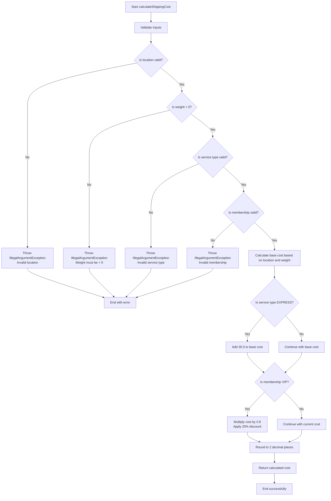

# Flowchart and Pseudocode for ShippingCalculator.java

## Flowchart (Mermaid)



## Pseudocode

### Main Function: calculateShippingCost(location, weight, serviceType, membership)

```
FUNCTION calculateShippingCost(location, weight, serviceType, membership)
    // Validate inputs
    IF NOT isValidLocation(location) THEN
        THROW IllegalArgumentException("Invalid location. Use BANGKOK or OTHER")
    END IF
    
    IF weight <= 0 THEN
        THROW IllegalArgumentException("Weight must be greater than 0")
    END IF
    
    IF NOT isValidServiceType(serviceType) THEN
        THROW IllegalArgumentException("Invalid service type. Use STANDARD or EXPRESS")
    END IF
    
    IF NOT isValidMembership(membership) THEN
        THROW IllegalArgumentException("Invalid membership. Use REGULAR or VIP")
    END IF
    
    // Calculate base cost based on location and weight
    baseCost = calculateBaseCost(location, weight)
    
    // Add express service fee if applicable
    IF serviceType EQUALS "EXPRESS" THEN
        baseCost = baseCost + 30.0
    END IF
    
    // Apply VIP discount if applicable
    IF membership EQUALS "VIP" THEN
        baseCost = baseCost * 0.8  // 20% discount
    END IF
    
    RETURN round(baseCost * 100.0) / 100.0  // Round to 2 decimal places
END FUNCTION
```

### Helper Function: calculateBaseCost(location, weight)

```
FUNCTION calculateBaseCost(location, weight)
    IF location EQUALS "BANGKOK" THEN
        RETURN getBangkokAreaCost(weight)
    ELSE
        RETURN getOtherProvinceCost(weight)
    END IF
END FUNCTION
```

### Helper Function: getBangkokAreaCost(weight)

```
FUNCTION getBangkokAreaCost(weight)
    IF weight <= 1 THEN
        RETURN 40.0
    ELSE IF weight <= 3 THEN
        RETURN 60.0
    ELSE IF weight <= 5 THEN
        RETURN 80.0
    ELSE
        RETURN 100.0
    END IF
END FUNCTION
```

### Helper Function: getOtherProvinceCost(weight)

```
FUNCTION getOtherProvinceCost(weight)
    IF weight <= 1 THEN
        RETURN 60.0
    ELSE IF weight <= 3 THEN
        RETURN 90.0
    ELSE IF weight <= 5 THEN
        RETURN 120.0
    ELSE
        RETURN 150.0
    END IF
END FUNCTION
```

### Validation Functions

```
FUNCTION isValidLocation(location)
    RETURN (location EQUALS "BANGKOK" OR location EQUALS "OTHER")
END FUNCTION

FUNCTION isValidServiceType(serviceType)
    RETURN (serviceType EQUALS "STANDARD" OR serviceType EQUALS "EXPRESS")
END FUNCTION

FUNCTION isValidMembership(membership)
    RETURN (membership EQUALS "REGULAR" OR membership EQUALS "VIP")
END FUNCTION
```

## Summary

The ShippingCalculator program works as follows:

1. **Input Validation**: First checks if all inputs (location, weight, service type, membership) are valid
2. **Base Cost Calculation**: Determines base shipping cost based on location (Bangkok area vs other provinces) and weight tier
3. **Additional Charges**: Adds 30 baht if express service is selected
4. **Discount Application**: Applies 20% discount if customer is VIP
5. **Final Calculation**: Rounds the result to 2 decimal places and returns the total cost

The program handles all the specified requirements:
- Different pricing for Bangkok area vs other provinces
- Weight-based pricing tiers
- Express service surcharge
- VIP membership discount
- Proper input validation